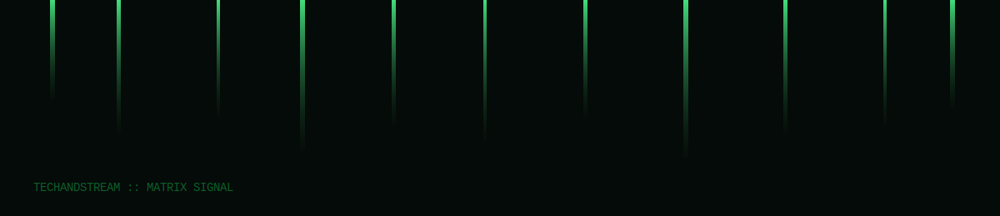

# Suivi Table Ronde




**Suivi Table Ronde** est un environnement web immersif pour préparer, animer et documenter des tables rondes avec rigueur,
clarté et impact. L'expérience met l'accent sur l'organisation, la transparence et la productivité — sans backend, en mode local.

## À propos du créateur

**Kevin Marville** — alias **Kvnbbg** pour l'open source, et **Techandstream** pour les projets commerciaux.

- **Open source** : expérimente des interfaces immersives, des outils de suivi, et des expériences UI/UX élégantes.
- **Freelance (Techandstream)** : livrables premium, UX fluide, exécution rapide, et communication claire.
- **Contact freelance** : [contact@techandstream.com](mailto:contact@techandstream.com)
- **GitHub** : https://github.com/kvnbbg

## Valeur livrée

- **Pilotage clair** : checklists, progression visuelle, focus sur les actions à fort impact.
- **Traçabilité** : journal communautaire pour consigner décisions, engagements et contributions.
- **Expérience immersive** : animations légères, interface responsive, et modes focus.
- **Zéro backend** : fonctionnement 100% local via le navigateur (Local Storage).

## Points d'entrée

- `index.html` : tableau de bord principal et expérience immersive.
- `community.html` : journal communautaire transparent.
- `bubbleRoom.html` : salle immersive pour préparation et inspiration.

## Animations & inspiration visuelle

- **Matrix effect** : intégré en SVG animé pour une signature visuelle futuriste.
- **Effets UI** : transitions, micro-animations et cartes flottantes.
- **Option premium** : intégrations Three.js, Web Components, ou versions TypeScript sur demande.

## Installation

```bash
npm install
```

## Lancer l'application

### Option 1 — ouvrir directement les fichiers HTML

Ouvrez `index.html` ou `community.html` dans votre navigateur.

### Option 2 — serveur local (recommandé)

```bash
npm run dev
```

Le serveur est disponible sur `http://localhost:8080` (par défaut).

### CLI (serveur local)

```bash
node scripts/serve.js --help
node scripts/serve.js --port 3000
```

## Configuration

Ce projet n'utilise pas de backend. Les configurations actuelles concernent le serveur local.
Un exemple est fourni dans `.env.example`.

```bash
# Exemple
PORT=8080
```

## API JavaScript (CommunityLog)

Le module `js/communityLog.js` expose une API accessible dans le navigateur ou en Node (tests).

```js
const entry = CommunityLog.createEntry({
  title: 'Décision',
  summary: 'Résumé de la discussion',
  commitments: 'Actions à suivre',
  participants: 'Collectif A',
  decisionType: 'consensus',
  tags: 'transparence, suivi',
});

const entries = CommunityLog.addEntry(entry);
```

## Scripts utiles

```bash
npm run lint      # Vérifie le lint (ESLint)
npm run format    # Vérifie le formatage (Prettier)
npm test          # Lance les tests Node
npm run build     # Valide les fichiers requis
```

## Dépannage

- **Le journal ne sauvegarde pas** : vérifiez que le navigateur autorise le Local Storage (mode privé strict ou extensions).
- **Aucune contribution ne s'affiche** : utilisez le bouton "Réinitialiser" ou exportez le journal en JSON pour inspection.
- **Le serveur local ne démarre pas** : changez de port via `PORT=3001 npm run dev`.

## Sécurité

- Les données restent **locales au navigateur** (Local Storage).
- Aucun secret ne doit être placé dans ce dépôt.
- Consultez `SECURITY.md` pour signaler une vulnérabilité.

## Contribution

Les contributions sont les bienvenues !
Consultez `CONTRIBUTING.md` pour le workflow (fork, branche, PR, revue).

## Licence

Ce projet est sous licence MPL 2.0.
